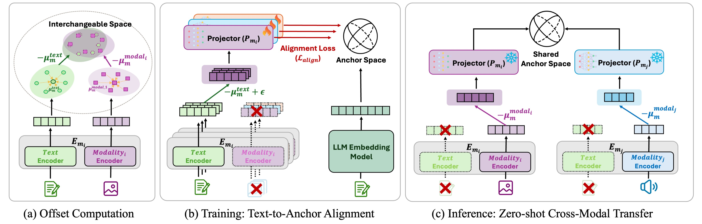

# TextME: Bridging Unseen Modalities Through Text Descriptions

[](https://arxiv.org/abs/2602.03098)
[](https://soyeonhh.github.io/TextME)
[](https://huggingface.co/SoyeonHH/TextME)
[](https://huggingface.co/datasets/SoyeonHH/textme-data)
[](https://opensource.org/licenses/MIT)

Official implementation of **TextME**, a text-only modality expansion framework that projects diverse modalities into LLM embedding space without requiring paired cross-modal data.

## 🔥 News
- **[2026.05]** TextME has been accepted to **ICML 2026**! 🎉

<p align="center">
  
</p>

## Table of Contents

- [Overview](#overview)
- [Supported Modalities](#supported-modalities)
- [Installation](#installation)
- [Pretrained Checkpoints](#pretrained-checkpoints)
- [Quick Start](#quick-start)
- [Training Pipeline](#training-pipeline)
- [Results](#results)
- [Project Structure](#project-structure)
- [Data](#data)
- [Configuration](#configuration)
- [Citation](#citation)
- [Acknowledgments](#acknowledgments)

## Overview

TextME leverages the **consistent modality gap** property of pretrained contrastive encoders to enable zero-shot cross-modal transfer using only text descriptions. Our framework:

- **Eliminates paired supervision**: Train projection networks using only ~100K text descriptions
- **Preserves pretrained performance**: Achieves 74.5% average Performance Preservation Ratio across 6 modalities
- **Enables emergent cross-modal retrieval**: Retrieval between unseen modality pairs (e.g., audio→3D, molecule→image)

## Supported Modalities

| Modality | Encoder | Embedding Dim | Training Dataset |
|----------|---------|---------------|------------------|
| Image | CLIP | 1024 | COCO |
| Image | LanguageBind | 768 | COCO |
| Video | ViCLIP | 768 | InternVid |
| Audio | CLAP | 512 | AudioCaps |
| 3D | Uni3D | 1024 | Objaverse |
| X-ray | CXR-CLIP | 512 | ChestX-ray |
| Molecule | MoleculeSTM | 256 | PubChem |
| Remote Sensing | RemoteCLIP | 768 | RemoteCLIP |

## Installation

```bash
# Clone repository
git clone https://github.com/SoyeonHH/TextME.git
cd TextME

# Create environment
conda create -n textme python=3.10
conda activate textme

# Install dependencies
pip install -r requirements.txt

# Verify installation
./scripts/test_setup.sh
```

## Pretrained Checkpoints

All projection checkpoints and offset vectors from the paper are available on HuggingFace:

```bash
pip install huggingface_hub
```

### Download All Checkpoints

```python
from huggingface_hub import snapshot_download

# Download all checkpoints (~845MB)
snapshot_download(repo_id="SoyeonHH/TextME", local_dir="./checkpoints")
```

### Download Individual Checkpoints

```python
from huggingface_hub import hf_hub_download

# Target encoder projections
clip_ckpt = hf_hub_download("SoyeonHH/TextME", "projections/target_encoders/clip.pt")
clap_ckpt = hf_hub_download("SoyeonHH/TextME", "projections/target_encoders/clap.pt")
uni3d_ckpt = hf_hub_download("SoyeonHH/TextME", "projections/target_encoders/uni3d.pt")
cxr_clip_ckpt = hf_hub_download("SoyeonHH/TextME", "projections/target_encoders/cxr_clip.pt")
moleculestm_ckpt = hf_hub_download("SoyeonHH/TextME", "projections/target_encoders/moleculestm.pt")
viclip_ckpt = hf_hub_download("SoyeonHH/TextME", "projections/target_encoders/viclip.pt")
remoteclip_ckpt = hf_hub_download("SoyeonHH/TextME", "projections/target_encoders/remoteclip.pt")

# LanguageBind source encoder projections (per-domain)
lb_coco = hf_hub_download("SoyeonHH/TextME", "projections/languagebind/languagebind_coco.pt")
lb_audiocaps = hf_hub_download("SoyeonHH/TextME", "projections/languagebind/languagebind_audiocaps.pt")
lb_objaverse = hf_hub_download("SoyeonHH/TextME", "projections/languagebind/languagebind_objaverse.pt")
lb_chestxray = hf_hub_download("SoyeonHH/TextME", "projections/languagebind/languagebind_chestxray.pt")
lb_pubchem = hf_hub_download("SoyeonHH/TextME", "projections/languagebind/languagebind_pubchem.pt")
lb_internvid = hf_hub_download("SoyeonHH/TextME", "projections/languagebind/languagebind_internvid.pt")

# Offset vectors
clip_offset = hf_hub_download("SoyeonHH/TextME", "offsets/clip_coco/text_embed_mean.pkl")
```

### Checkpoint Structure

```
SoyeonHH/TextME/
├── projections/
│   ├── languagebind/                      # Source text encoder projections
│   │   ├── languagebind_coco.pt           # Image domain (59MB)
│   │   ├── languagebind_audiocaps.pt      # Audio domain (59MB)
│   │   ├── languagebind_objaverse.pt      # 3D domain (59MB)
│   │   ├── languagebind_chestxray.pt      # X-ray domain (59MB)
│   │   ├── languagebind_pubchem.pt        # Molecule domain (59MB)
│   │   ├── languagebind_remoteclip_ret3.pt # Remote sensing domain (59MB)
│   │   └── languagebind_internvid.pt      # Video domain (59MB)
│   └── target_encoders/                   # Target modality encoder projections
│       ├── clip.pt                        # Image: CLIP (85MB)
│       ├── viclip.pt                      # Video: ViCLIP (59MB)
│       ├── clap.pt                        # Audio: CLAP (37MB)
│       ├── uni3d.pt                       # 3D: Uni3D (85MB)
│       ├── cxr_clip.pt                    # X-ray: CXR-CLIP (37MB)
│       ├── moleculestm.pt                 # Molecule: MoleculeSTM (17MB)
│       ├── remoteclip.pt                  # Remote Sensing: RemoteCLIP (59MB)
│       └── languagebind.pt                # Multi-modal: LanguageBind (59MB)
└── offsets/                               # Precomputed modality gap offset vectors
    ├── clip_coco/                         # {text,img}_embed_mean.pkl
    ├── clap_audiocaps/
    ├── uni3d_objaverse/
    ├── cxr_clip_chestxray/
    ├── moleculestm_pubchem/
    ├── remoteclip_ret3/
    ├── languagebind_coco/
    └── viclip_internvid/
```

## Quick Start

### Using Scripts (Recommended)

We provide convenient shell scripts for each stage of the pipeline:

```bash
# 1. Compute offset vectors for a specific encoder
./scripts/compute_offsets.sh clip      # Single encoder
./scripts/compute_offsets.sh all       # All encoders

# 2. Train projection network
./scripts/train.sh clip                # Train CLIP projection
./scripts/train.sh uni3d               # Train Uni3D projection
./scripts/train.sh all                 # Train all projections

# 3. Run evaluation
./scripts/evaluate.sh                  # Full evaluation suite

# Or evaluate specific tasks
./scripts/eval_retrieval.sh image coco          # Image retrieval on COCO
./scripts/eval_retrieval.sh audio audiocaps    # Audio retrieval
./scripts/eval_classification.sh 3d modelnet40 # 3D classification
./scripts/eval_classification.sh audio esc50   # Audio classification
```

**Supported encoders:** `clip`, `clap`, `uni3d`, `cxr_clip`, `moleculestm`, `remoteclip`, `languagebind`

Before running, configure environment variables in scripts:
```bash
export DATA_ROOT=/path/to/pretraining_captions
export RAW_DATA_ROOT=/path/to/raw_data
export EMBED_DIR=/path/to/qwen3_4B_embeds
```

### Using Python Commands

#### 1. Compute Offset Vectors

Estimate modality-specific centroids for the interchangeable space:

```bash
python compute_offset.py \
    --offset_model clip \
    --dataset_name coco \
    --data_root /path/to/captions \
    --raw_data_root /path/to/coco/images \
    --saving_path ./offsets/5000/clip_coco \
    --offset_num 5000 \
    --dim 1024 \
    --batch_size 64
```

#### 2. Train Projection Network

Train a lightweight projection head using only text descriptions:

```bash
python train.py \
    --model_name clip \
    --pivot_model_name qwen3_embed_4b \
    --dataset_name coco \
    --data_root /path/to/captions \
    --embed_dir /path/to/precomputed_embeds \
    --use_offset \
    --use_projection \
    --offset_dir ./offsets \
    --offset_num 5000 \
    --out_dim 2560 \
    --batch_size 256 \
    --epochs 50 \
    --lr 5e-4 \
    --checkpoint_dir ./checkpoints \
    --save_logs
```

#### 3. Evaluation

**Text-to-Audio Retrieval:**

```bash
python evaluate.py \
    --val_al_ret_data AudioCaps \
    --source_model_name languagebind \
    --target_model_name clap \
    --pivot_model_name qwen3_embed_4b \
    --use_offset \
    --use_projection \
    --load_projection_checkpoint \
    --languagebind_proj_checkpoint ./checkpoints/projections/languagebind/languagebind_audiocaps.pt \
    --clap_proj_checkpoint ./checkpoints/projections/target_encoders/clap.pt
```

**Text-to-Image Retrieval:**

```bash
python evaluate.py \
    --val_il_ret_data flickr \
    --source_model_name languagebind \
    --target_model_name clip \
    --pivot_model_name qwen3_embed_4b \
    --use_offset \
    --use_projection \
    --multi_sentence True \
    --load_projection_checkpoint \
    --languagebind_proj_checkpoint ./checkpoints/projections/languagebind/languagebind_coco.pt \
    --clip_proj_checkpoint ./checkpoints/projections/target_encoders/clip.pt
```

**Zero-Shot 3D Classification:**

```bash
python evaluate.py \
    --val_p_cls_data modelnet40 \
    --source_model_name languagebind \
    --target_model_name uni3d \
    --pivot_model_name qwen3_embed_4b \
    --use_offset \
    --use_projection \
    --load_projection_checkpoint \
    --languagebind_proj_checkpoint ./checkpoints/projections/languagebind/languagebind_objaverse.pt \
    --uni3d_proj_checkpoint ./checkpoints/projections/target_encoders/uni3d.pt
```

**Zero-Shot X-ray Classification:**

```bash
python evaluate.py \
    --val_x_cls_data rsna \
    --source_model_name languagebind \
    --target_model_name cxr_clip \
    --pivot_model_name qwen3_embed_4b \
    --use_offset \
    --use_projection \
    --load_projection_checkpoint \
    --languagebind_proj_checkpoint ./checkpoints/projections/languagebind/languagebind_chestxray.pt \
    --cxr_clip_proj_checkpoint ./checkpoints/projections/target_encoders/cxr_clip.pt
```

## Training Pipeline

TextME operates in three stages (see Figure 2 in the [paper](https://arxiv.org/abs/2602.03098) for an illustration):

**Stage 1: Offset Computation.** We estimate modality-specific centroids (μ_text and μ_modal) from ~5K unpaired samples per modality. Subtracting these centroids creates an *interchangeable space* where centered text and modal embeddings become functionally equivalent.

**Stage 2: Text-to-Anchor Alignment.** Using only text descriptions, we train a lightweight 2-layer MLP projection head to map centered text embeddings into the Qwen3-Embedding-4B anchor space (2560-dim). Training uses contrastive loss with hard negative mining.

**Stage 3: Zero-Shot Cross-Modal Transfer.** At inference, we apply the same centering to modal embeddings and project them through the trained network. Since centered text and modal embeddings occupy the same region, the text-trained projector generalizes to unseen modalities without any paired supervision.

## Results

### Text→X Retrieval (R@1)

| Method | Image (Flickr) | Video (MSVD) | Audio (ACaps) | Molecule (Drug) |
|--------|----------------|--------------|---------------|-----------------|
| Pretrained | 77.70 | 51.06 | 22.47 | 79.19 |
| LanguageBind | 73.42 | 65.22 | 12.42 | × |
| Ex-MCR | 71.89 | × | 19.07 | × |
| **TextME** | **51.66** | **45.82** | **15.35** | **34.75** |
| PPR (%) | 66.5 | 89.7 | 68.3 | 43.9 |

### Zero-Shot Classification (Top-1 Acc)

| Method | 3D (MN40) | 3D (Scan) | Audio (ESC) | X-ray (RSNA) |
|--------|-----------|-----------|-------------|--------------|
| Pretrained | 67.75 | 42.21 | 85.20 | 52.64 |
| **TextME** | **70.86** | **42.15** | **77.25** | **46.59** |
| PPR (%) | 104.6 | 99.9 | 90.7 | 88.5 |

## Project Structure

```
TextME/
├── compute_offset.py      # Stage 1: Offset computation
├── train.py               # Stage 2: Projection training
├── evaluate.py            # Stage 3: Evaluation
├── textme/
│   ├── __init__.py
│   ├── models/
│   │   ├── encoders.py    # Encoder wrappers (CLIP, CLAP, Uni3D, etc.)
│   │   └── projector.py   # Projection head (2-layer MLP)
│   ├── data/
│   │   ├── __init__.py
│   │   └── datasets.py    # Dataset implementations
│   ├── evaluation/
│   │   ├── __init__.py
│   │   ├── config.py      # Evaluation argument parser
│   │   └── eval_utils.py  # Evaluation utilities (R@k, mAP, etc.)
│   ├── losses.py          # Loss functions (HardNegativeContrastiveLoss)
│   └── utils.py           # Training utilities
├── scripts/
│   ├── test_setup.sh          # Verify installation
│   ├── compute_offsets.sh     # ./compute_offsets.sh [ENCODER|all]
│   ├── train.sh               # ./train.sh [ENCODER|all]
│   ├── evaluate.sh            # Run full evaluation suite
│   ├── eval_retrieval.sh      # ./eval_retrieval.sh [MODALITY] [DATASET]
│   ├── eval_classification.sh # ./eval_classification.sh [MODALITY] [DATASET]
│   └── prepare_hf_datasets.py # Prepare datasets for HuggingFace upload
├── configs/               # Configuration files
└── requirements.txt
```

## Data

### Training Captions (HuggingFace Dataset)

Text descriptions for training projection networks are available on HuggingFace:

```python
from datasets import load_dataset

# Load specific caption dataset
coco = load_dataset("SoyeonHH/textme-data", data_files="captions/coco.parquet")
audiocaps = load_dataset("SoyeonHH/textme-data", data_files="captions/audiocaps.parquet")
```

| Dataset | Modality | Samples | Description |
|---------|----------|---------|-------------|
| COCO | Image | 591K | Image captions |
| AudioCaps | Audio | 49K | Audio descriptions |
| Objaverse | 3D | 1.5M | 3D object descriptions |
| ChestX-ray | X-ray | 112K | Radiology reports |
| PubChem | Molecule | 250K | Molecular descriptions |
| RemoteCLIP | Remote | 68K | Satellite image captions |
| InternVid | Video | 100K | Video descriptions |

### Offset Vectors & Checkpoints (HuggingFace Model)

Precomputed offset vectors and trained projection checkpoints are in the [model repository](https://huggingface.co/SoyeonHH/TextME). See [Pretrained Checkpoints](#pretrained-checkpoints) above for download instructions.

### Prepare Your Own Data

```bash
python scripts/prepare_hf_datasets.py \
    --caption_dir /path/to/pretraining_captions \
    --output_dir ./hf_datasets

python scripts/prepare_hf_datasets.py \
    --output_dir ./hf_datasets \
    --upload \
    --repo_id SoyeonHH/textme-data
```

## Configuration

Key hyperparameters:

| Parameter | Value |
|-----------|-------|
| Batch size | 512 |
| Optimizer | AdamW (β₁=0.9, β₂=0.999) |
| Weight decay | 0.01 |
| Learning rate | 5×10⁻⁴ |
| LR schedule | Cosine annealing |
| Training epochs | 50 |
| Temperature τ | 0.07 |
| Hard negative range | [0.1·sᵢ, 0.9·sᵢ] |

## Citation

```bibtex
@article{hong2026textme,
  title={TextME: Bridging Unseen Modalities Through Text Descriptions},
  author={Hong, Soyeon and Kim, Jinchan and You, Jaegook and Choi, Seungtaek and Kwak, Suha and Cho, Hyunsouk},
  journal={arXiv preprint arXiv:2602.03098},
  year={2026}
}
```

## Acknowledgments

This work builds upon several excellent open-source projects:
- [CLIP](https://github.com/openai/CLIP)
- [CLAP](https://github.com/LAION-AI/CLAP)
- [Uni3D](https://github.com/baaivision/Uni3D)
- [LanguageBind](https://github.com/PKU-YuanGroup/LanguageBind)
- [Qwen3-Embedding](https://huggingface.co/Alibaba-NLP/Qwen3-Embedding-4B)

## License

This project is licensed under the MIT License - see the [LICENSE](LICENSE) file for details.
